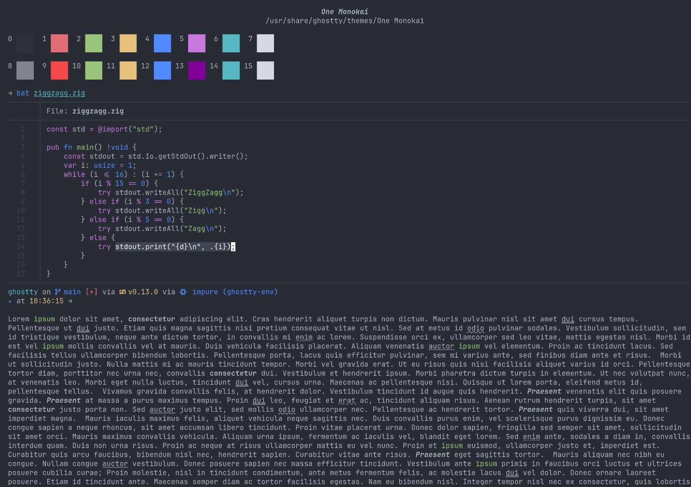

# One Monokai Theme for Ghostty

This is a conversion of the popular One Monokai theme from VSCode for the Ghostty terminal. A cross between Monokai and One Dark theme.

## Preview

## Usage

Set `theme = One Monokai` in your [Ghostty configuration file](https://ghostty.org/docs/config#file-location).

### Direct/Manually

To install this theme, see the following instructions:

1. Download the file and copy it to the `themes/` subdirectory of your [Ghostty configuration _directory_](https://ghostty.org/docs/config#file-location) (i.e. `~/.config/ghostty/themes/`).
2. Set `theme = One Monokai` in your [Ghostty configuration *file*](https://ghostty.org/docs/config#file-location).
3. Reload or restart Ghostty.
